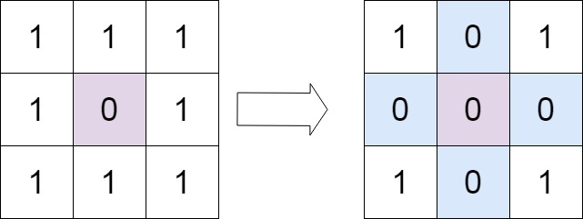

# Questions
--------------------------
## Set Matrix Zeros
Given an m x n matrix. If an element is 0, set its entire row and column to 0. Do it in-place.  

Follow up:  

A straight forward solution using O(mn) space is probably a bad idea.  
A simple improvement uses O(m + n) space, but still not the best solution.  
Could you devise a constant space solution?    
 

Example 1:  

Input: matrix = [[1,1,1],[1,0,1],[1,1,1]]  
Output: [[1,0,1],[0,0,0],[1,0,1]]  

Example 2:

Input: matrix = [[0,1,2,0],[3,4,5,2],[1,3,1,5]]  
Output: [[0,0,0,0],[0,4,5,0],[0,3,1,0]]  
 

Constraints:  

- m == matrix.length
- n == matrix[0].length
- 1 <= m, n <= 200
- -231 <= matrix[i][j] <= 231 - 1
