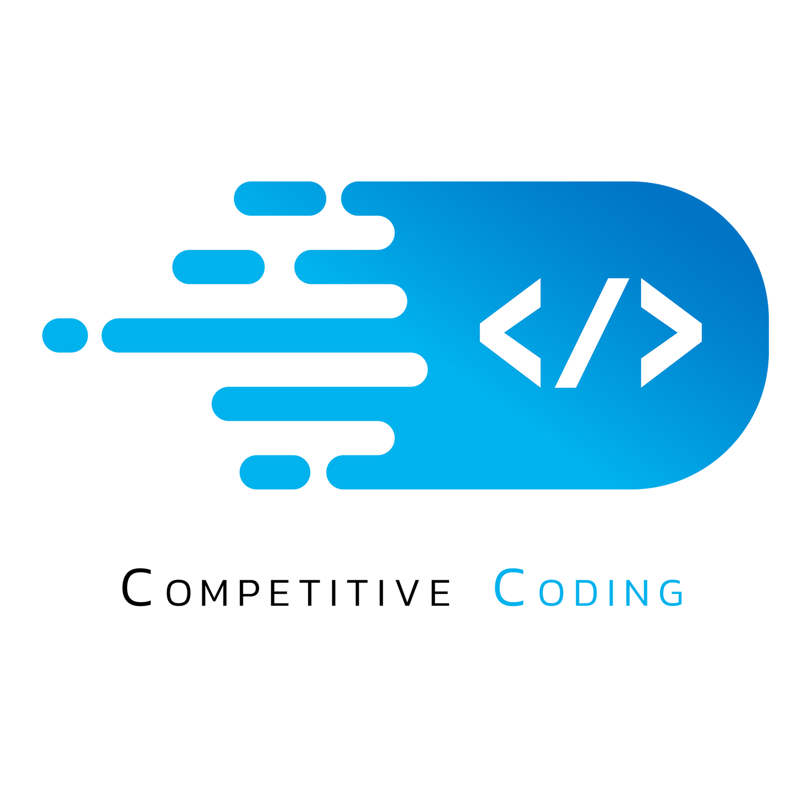

# Competitive-Programming
Collection of my solutions to various competitive programming problems.  
Will be updating this repo on a regular basis.  

-------------------------------------

:star: Happiness should be a function without any parameters :star:    
<b>Happy Coding</b> :exclamation: :exclamation:

